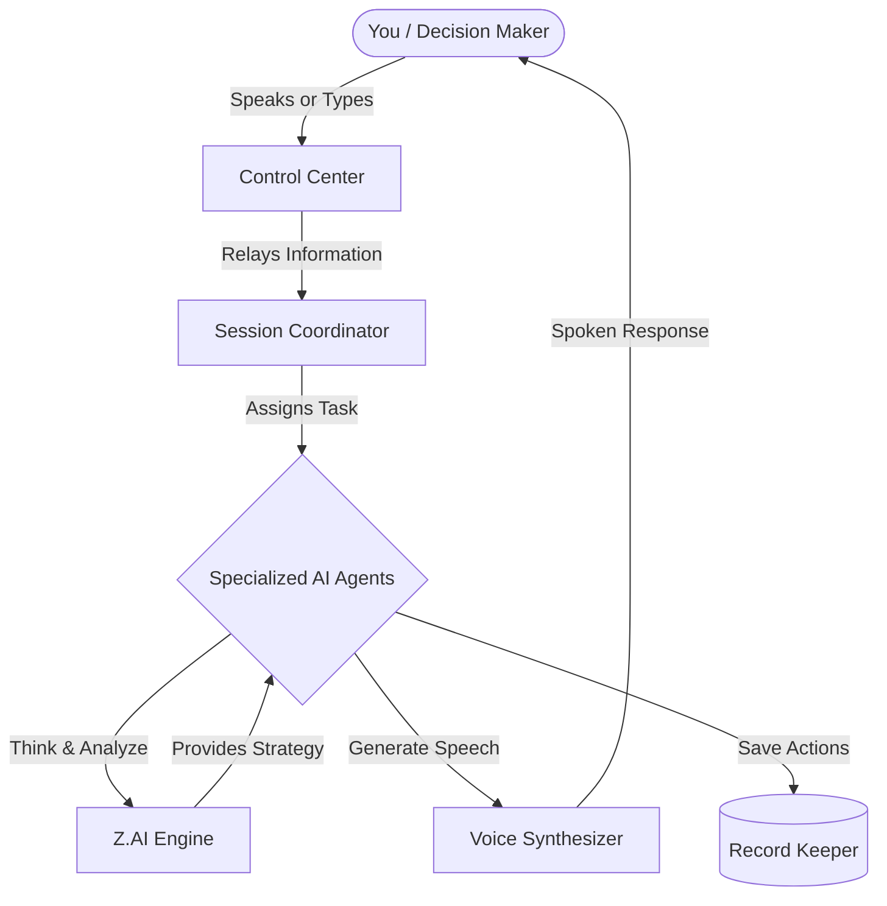
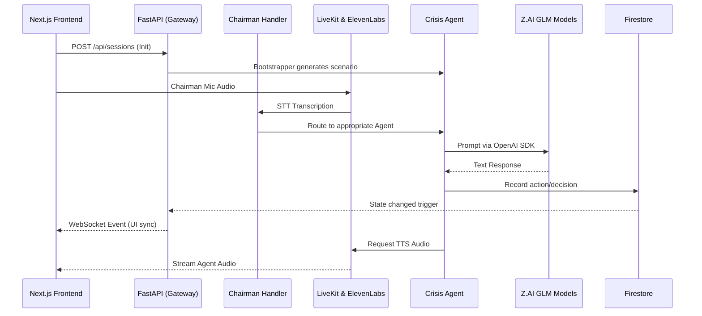

# WAR ROOM — Backend Architecture

The backend of the **WAR ROOM** application is a robust, asynchronous API built with [FastAPI](https://fastapi.tiangolo.com/). It serves as the central orchestration layer for a multi-agent AI crisis simulation platform, managing real-time communications, scenario generation, and autonomous agent behavior.

## High-Level Documentation

This document outlines the core architecture and systemic components that power the backend simulation environment.

## System Overview 

Think of the WAR ROOM backend as the control center of a highly coordinated team of experts. When a crisis begins, the control center immediately brings in specialized advisors (our AI Agents) tailored to the situation—such as legal experts, public relations managers, or military strategists.

Here is a simplified visual of how information flows during a simulation:

### Key Concepts Discussed

* **The Decision Maker:** You interact with the system by speaking or typing.
* **The Control Center (Gateway):** Receives your input and ensures the entire platform stays perfectly synced.
* **The Coordinator:** Acts as the meeting manager, taking your input and directing it to the right expert on the team.
* **Specialized AI Agents:** These are the unique personas in the room. They consult their "brain" (the Z.AI Engine) to analyze the problem and formulate strategies.
* **Voice Synthesizer:** Gives each agent a distinct, realistic voice so they can converse with you instantly.
* **Record Keeper:** Safely stores every decision, transcript, and event so the team remembers exactly what has happened throughout the crisis.

### Core Technologies

* **Framework:** FastAPI (Python 3.10+) running on Uvicorn.
* **AI Integration:**
* **Z.AI GLM Models:** For text-based agent reasoning, multi-modal intake, and scenario generation. Accessed via the OpenAI Python SDK.
* **ElevenLabs:** For rapid STT (Speech-to-Text) transcription and ultra-realistic TTS (Text-to-Speech) voice synthesis.
* **LiveKit:** For WebRTC audio distribution and management.
* **Database & Storage:** Google Cloud Firestore (production state management) with an in-memory mock adapter for local development and testing.

## System Architecture

The backend code is modularized into several key domains:

### 1. The Gateway (`/gateway`)

The Gateway handles all external communication with the Next.js frontend, exposing both RESTful endpoints and WebSockets.

* **REST Routes:** Endpoints logically grouped by domain (e.g., `agent_routes.py`, `scenario_routes.py`, `resolution_routes.py`, `intel_routes.py`) for fetching state, managing sessions, and triggering actions.
* **WebSocket Routers:** Enables bi-directional, real-time sync. It pushes crisis events to connected clients and receives real-time audio streams from the user orchestrating the simulation (`chairman_audio_ws.py`).
* **Connection Managers:** `connection_manager.py` maintains active socket connections and broadcasts state mutations efficiently to the frontend.

### 2. Autonomous Agent Ecosystem (`/agents`)

The simulation is driven by distinct, specialized AI agents operating concurrently.

* **`base_crisis_agent.py`:** The foundational base class that defines the lifecycle, reasoning loop, and communication methods for any participant agent.
* **`dynamic_agent_factory.py`:** A factory module that instantiates specialized crisis agents with specific personalities and domains (e.g., Military, PR, Legal) dynamically based on the scenario's needs.
* **`world_agent.py`:** Simulates the external environment (public reaction, media, stock markets) and injects unpredictable escalation events into the crisis.
* **`scenario_analyst.py`:** Generates cohesive, intricate crisis scenarios based on user prompts.
* **`observer_agent.py`:** Evaluates agent decisions, calculates trust scores, and assesses overall resolution trajectory.

### 3. Session & Event Management

* **Bootstrapper (`session_bootstrapper.py`):** When a new crisis is initiated, the bootstrapper asynchronously spins up the scenario, seeds initial database structures, generates the world agent parameters, and creates the roster of responding crisis agents.
* **Chairman Handler (`chairman_handler.py`):** An orchestrator that directly receives inputs from the user (The Chairman/Director), delegates them to the appropriate crisis agents, manages active agents per session, and enforces communication flow.

### 4. Audio Pipeline & Voice Engine (`/voice`)

* Manages the complex orchestration of LiveKit sessions, OpenAI API LLM configurations, and ElevenLabs voice assignments (`voice_assignment.py` & `voice_routes.py`).
* It ensures that distinct, consistent voices are mapped to generated agents, creating an immersive localized audio experience while enforcing a strict gate for speaker turns to prevent voice leakage.

## Data Flow & Lifecycle

1. **Initialization:** The frontend requests a new session via POST `/api/sessions`. `main.py` writes an initial "assembling" state to Firestore and offloads heavy scenario generation to `session_bootstrapper.py` via background tasks.
2. **Streaming:** The frontend establishes WebSocket connections.
3. **Active Simulation:** The user speaks or sends directives. The `chairman_handler.py` processes this, invokes the necessary `CrisisAgent` instances, which then query context, compute responses via Z.AI GLM using OpenAI SDK, trigger TTS streaming via ElevenLabs, and broadcast the resulting audio/transcripts back through the WebSocket gateway.
4. **Escalations:** Concurrently, the `WorldAgent` evaluates session time and injects new variables, pushing updates directly to event streams.
5. **Resolution:** The session concludes, shutting down background AI tasks, releasing WebSocket links, and dumping actionable scenario history to the DB for after-action reports.

## Running the Application

Please refer to the root `README.md` for standard environment setup and installation instructions. Environment variable specifications can be found in `.env.example`.
