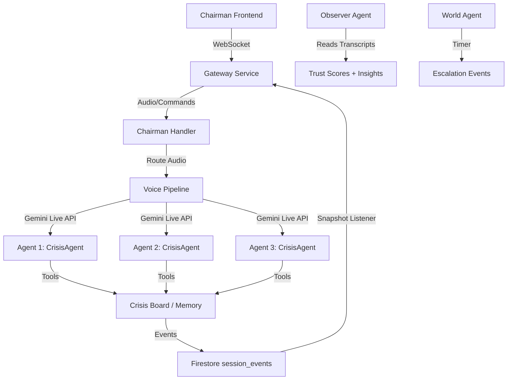

# WAR ROOM Backend — Implementation Walkthrough

## What Was Built

The complete WAR ROOM backend: a multi-agent AI crisis simulation platform using Google ADK, Gemini Live API, and Firestore.

## Architecture



## Files Created (30+)

| Layer | Files | Purpose |
|-------|-------|---------|
| **Config** | [settings.py](file:///home/okey/Desktop/Projects/war-room/backend/config/settings.py), [constants.py](file:///home/okey/Desktop/Projects/war-room/backend/config/constants.py) | Env config, 20+ event types, voice pool |
| **Utils** | [pydantic_models.py](file:///home/okey/Desktop/Projects/war-room/backend/utils/pydantic_models.py), [events.py](file:///home/okey/Desktop/Projects/war-room/backend/utils/events.py), [firestore_helpers.py](file:///home/okey/Desktop/Projects/war-room/backend/utils/firestore_helpers.py) | Firestore schema, event push, posture/score updates |
| **Tools** | [crisis_board_tools.py](file:///home/okey/Desktop/Projects/war-room/backend/tools/crisis_board_tools.py), [memory_tools.py](file:///home/okey/Desktop/Projects/war-room/backend/tools/memory_tools.py), [event_tools.py](file:///home/okey/Desktop/Projects/war-room/backend/tools/event_tools.py), [agent_tools.py](file:///home/okey/Desktop/Projects/war-room/backend/tools/agent_tools.py) | ADK tools for agents |
| **Agents** | [base_crisis_agent.py](file:///home/okey/Desktop/Projects/war-room/backend/agents/base_crisis_agent.py), [scenario_analyst.py](file:///home/okey/Desktop/Projects/war-room/backend/agents/scenario_analyst.py), [skill_generator.py](file:///home/okey/Desktop/Projects/war-room/backend/agents/skill_generator.py), [voice_assignment.py](file:///home/okey/Desktop/Projects/war-room/backend/agents/voice_assignment.py), [observer_agent.py](file:///home/okey/Desktop/Projects/war-room/backend/agents/observer_agent.py), [world_agent.py](file:///home/okey/Desktop/Projects/war-room/backend/agents/world_agent.py), [dynamic_agent_factory.py](file:///home/okey/Desktop/Projects/war-room/backend/agents/dynamic_agent_factory.py) | Full agent system |
| **Voice** | [pipeline.py](file:///home/okey/Desktop/Projects/war-room/backend/voice/pipeline.py), [audio_utils.py](file:///home/okey/Desktop/Projects/war-room/backend/voice/audio_utils.py) | Audio streaming, interrupts, VAD |
| **Gateway** | [main.py](file:///home/okey/Desktop/Projects/war-room/backend/gateway/main.py), [chairman_handler.py](file:///home/okey/Desktop/Projects/war-room/backend/gateway/chairman_handler.py), [connection_manager.py](file:///home/okey/Desktop/Projects/war-room/backend/gateway/connection_manager.py) | WebSocket, command routing |
| **Root** | [session_bootstrapper.py](file:///home/okey/Desktop/Projects/war-room/backend/session_bootstrapper.py), [main.py](file:///home/okey/Desktop/Projects/war-room/backend/main.py), [Dockerfile](file:///home/okey/Desktop/Projects/war-room/backend/Dockerfile), [cloudbuild.yaml](file:///home/okey/Desktop/Projects/war-room/backend/cloudbuild.yaml) | Entry point, deployment |

## Test Results

```
============ 34 passed, 1 warning in 1.12s ============
```

| Test File | Tests | What's Validated |
|-----------|-------|-----------------|
| [test_agent_isolation.py](file:///home/okey/Desktop/Projects/war-room/backend/tests/test_agent_isolation.py) | 6 | Separate session services, scoped Firestore refs, memory isolation, cross-agent read limits, hidden knowledge exclusion, unique voices |
| [test_event_system.py](file:///home/okey/Desktop/Projects/war-room/backend/tests/test_event_system.py) | 8 | Event ID generation, required fields, schema compliance for 6 event types, source agent propagation |
| [test_crisis_board_tools.py](file:///home/okey/Desktop/Projects/war-room/backend/tests/test_crisis_board_tools.py) | 7 | Read/write decisions, conflicts, intel, nonexistent session handling |
| [test_scenario_analyst.py](file:///home/okey/Desktop/Projects/war-room/backend/tests/test_scenario_analyst.py) | 13 | Schema compliance, agent count, conflict rules, escalation ordering, Pydantic validation, SKILL.md content verification |

## Key Design Decisions

- **Agent Isolation**: Each agent gets its own `InMemorySessionService`, unique Firestore document path (`agent_memory/{agent_id}_{session_id}`), and tool closures binding only its own IDs
- **Mock Fallbacks**: Every GCP dependency (`google.cloud.firestore`, `google.adk`, `google.genai`) has a graceful fallback for local development
- **Event-Driven**: All frontend updates flow through [push_event()](file:///home/okey/Desktop/Projects/war-room/backend/utils/events.py#91-126) → Firestore `session_events` → WebSocket snapshot listener
- **Voice Pipeline**: Full Gemini Live API integration with interruption handling, transcript capture, and Observer feed
